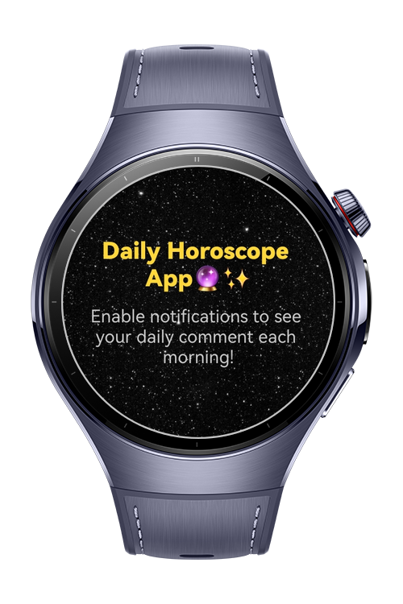
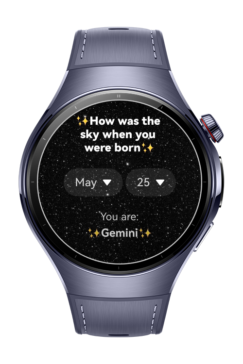
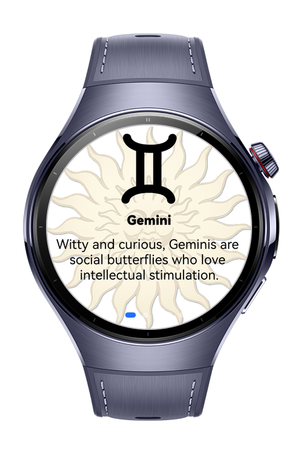
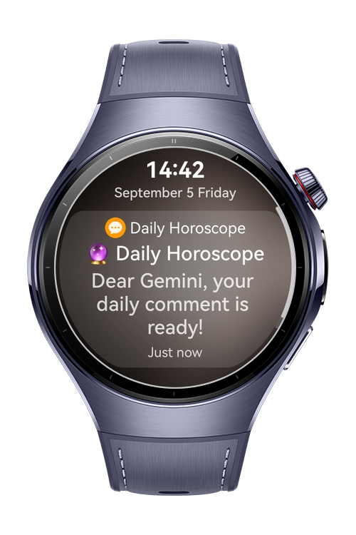

> **Note:** To access all shared projects, get information about environment setup, and view other guides, please visit [Explore-In-HMOS-Wearable Index](https://github.com/Explore-In-HMOS-Wearable/hmos-index).

# DailyHoroscopeApp

Daily Horoscope App is a horoscope application that saves user's horoscope and send daily reminders each morning. Also users can read other horoscope's daily comments with swiper functionality.

# Preview

<p align="left">
  
  
  
  
</p>

# Use Cases

- User can select birth date and see her/his own horoscope.
- By clicking the horoscope the horoscope date is being saved to the storage.
- Swiper page is shown starts with the user's horoscope.
- By swiping other zodiac's descriptions can be read.
- Daily notifications come to the wearable device.

# Tech Stack

- **Languages**: ArkTS, ArkUI
- **Frameworks**: HarmonyOS SDK 5.0.2(18)
- **Tools**: DevEco Studio Vers 5.1.0.842
- **Libraries**: 
- `@kit.ArkUI`, 
- `@kit.NotificationKit`, 
- `@kit.BasicServicesKit`, 
- `@kit.PerformanceAnalysisKit`, 
- `@kit.AbilityKit`,
- `@kit.BackgroundTasksKit`, 
- `@kit.SensorServiceKit`

# Directory Structure

```
entry/src/main/ets/
|---components      
|   |---HoroscopeComponent.ets
|---entryability                   
|---entrybackupability   
|---model      
|   |---Horoscope.ets
|---pages
|   |---HoroscopePage.ets   
|   |---Index.ets   
|   |---SwiperPage.ets                
|---utils      
|   |---Logger.ets      
|   |---Notification.ets     
|   |---Utils.ets  
|---viewmodel      
|   |---HoroscopeViewModel.ets                                               
```
# Constraints and Restrictions
## Supported Devices

- Huawei Watch 5

## Required Permissions

- "ohos.permission.KEEP_BACKGROUND_RUNNING",
- "ohos.permission.INTERNET",
- "ohos.permission.VIBRATE",
- "ohos.permission.PUBLISH_AGENT_REMINDER"

# LICENSE

Daily Horoscope App is distributed under the terms of the MIT License.
See the [license](/LICENSE) for more information.
