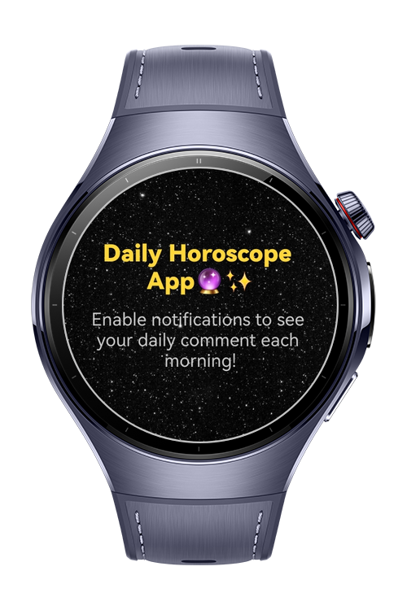
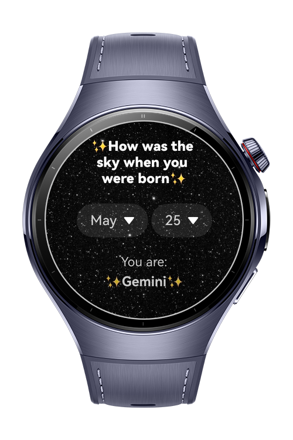
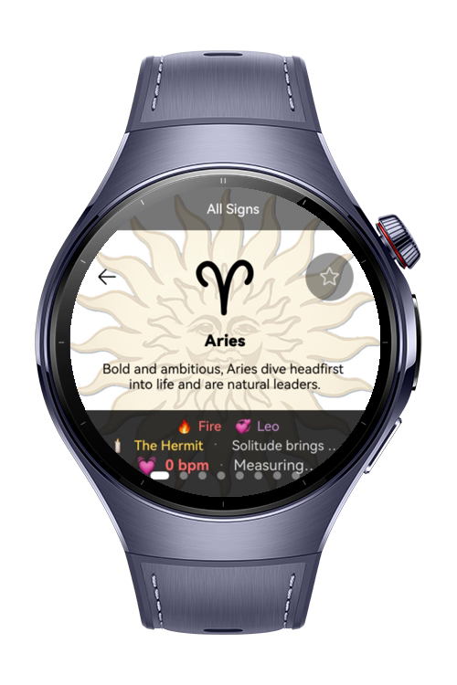
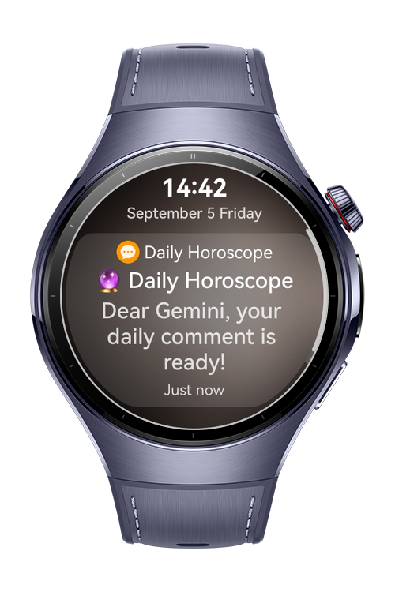

# DailyHoroscopeApp

A comprehensive wearable horoscope application for HarmonyOS smartwatches. Select your zodiac sign by birthdate, receive daily morning reminders, and explore all 12 signs with swiper navigation.
Features moon phase tracking, favorite signs bookmarking, elemental compatibility badges, daily tarot cards, habit-building streak counter, and real-time heart rate integration for personalized guidance. Optimized for circular screens with offline-first design.
# Preview

<p align="left">
  
  
  
  
</p>

# Use Cases

- User selects birth date to discover their zodiac sign
- Clicking the sign saves it to storage and enables daily notifications
- Swiper page opens showing user's horoscope first
- Swipe to explore all 12 zodiac signs with descriptions
- Daily morning reminders delivered to wearable device
- Star favorite signs for quick access with filter toggle
- View moon phase, daily tarot card, and elemental compatibility
- Track daily visit streak to build consistent habits
- Real-time heart rate reading provides personalized state-based guidance

# Technology
 
## Stack

- **Languages**: ArkTS, ArkUI
- **Frameworks**: HarmonyOS SDK 5.0.2(18)
- **Tools**: DevEco Studio Vers 5.1.0.842
- **Libraries**: 
- `@kit.ArkUI`, 
- `@kit.NotificationKit`, 
- `@kit.BasicServicesKit`, 
- `@kit.PerformanceAnalysisKit`, 
- `@kit.AbilityKit`,
- `@kit.BackgroundTasksKit`, 
- `@kit.SensorServiceKit`

## Required Permissions

- "ohos.permission.KEEP_BACKGROUND_RUNNING",
- "ohos.permission.INTERNET",
- "ohos.permission.VIBRATE",
- "ohos.permission.PUBLISH_AGENT_REMINDER"
- "ohos.permission.READ_HEALTH_DATA"

# Directory Structure

```
entry/src/main/ets/
|---components      
|   |---HoroscopeComponent.ets
|---model      
|   |---Horoscope.ets
|   |---TarotDeck.ets
|   |---ZodiacMeta.ets
|---pages
|   |---HoroscopePage.ets   
|   |---HomePage.ets   
|   |---Index.ets   
|   |---SwiperPage.ets         
|---services
|   |---FavoritesService.ets      
|   |---HeartRateService.ets    
|   |---StreakService.ets   
|---utils      
|   |---Logger.ets      
|   |---Notification.ets    
|   |---MoonPhaseCalculator.ets     
|   |---Utils.ets  
|---viewmodel      
|   |---HoroscopeViewModel.ets  
|   |---HeartRateViewModel.ets                                         
```
# Constraints and Restrictions
## Supported Devices

- Huawei Watch 5

# LICENSE

Daily Horoscope App is distributed under the terms of the MIT License.
See the [license](./LICENSE) for more information.
